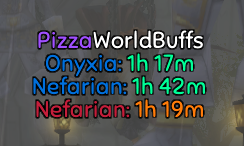
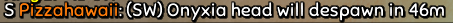

# 🍕 PizzaWorldBuffs

Addon for [TurtleWoW](https://turtle-wow.org) that shows Onyxia/Nefarian head despawn timers. Timers are constantly shared between all players, so you will still get them if you're not in the city and even if you weren't online when the buff popped. See [below](#how-it-works) for more details on how it works.



> [!IMPORTANT]
>
> **This addon does NOT show you when the next buff will be triggered!** 
> 
> It only shows you when the window for the buff to be triggered will open up again, i.e. when the Ony/Nef heads will despawn from the SW/OG city gates. The actual buff is only triggered when a player turns in the head of Ony/Nef and the addon can't possibly know when that's going to happen.

## Install

1. Download and extract [latest version](https://github.com/Pizzahawaiii/PizzaWorldBuffs/archive/main.zip)
2. Copy the "PizzaWorldBuffs-main" folder to `<WoW>/Interface/AddOns` and rename it to "PizzaWorldBuffs"
3. (Re)start WoW

## Version Upgrade

To update to the latest version, delete your `<WoW>/Interface/AddOns/PizzaWorldBuffs` folder and follow the [installation steps](#install) again.

If updating to the latest version causes any issues, delete `<WoW>/WTF/Account/<Account>/<Server>/<Character>/SavedVariables/PizzaWorldBuffs.lua` and restart WoW. If the problems persist, please [create an issue](https://github.com/Pizzahawaiii/PizzaWorldBuffs/issues/new).

Check the [commit history](https://github.com/Pizzahawaiii/PizzaWorldBuffs/commits/main) to see the latest changes.

## Commands

```
/wb                    Show all commands
/wb show               Show the addon
/wb hide               Hide the addon
/wb header <1 or 0>    1 to show PizzaWorldBuffs header, 0 to hide it
/wb all <1 or 0>       1 to show timers for both factions, 0 to only show timers for your faction
/wb sharing <1 or 0>   1 to enable timer sharing between you and other players, 0 to only see your
                       own timers and not share them with anyone
/wb logout <1 or 0>    1 to log out automatically after receiving the next buff, 0 to stay logged in
/wb exit <1 or 0>      1 to exit game automatically after receiving the next buff, 0 to stay logged in
/wb reset              Reset PizzaWorldBuffs frames to their default positions
/wb fontSize <size>    Change the font size of the PizzaWorldBuff frame (Default: 14)
/wb align <x>          Change text alignment. Valid options: left, center, right (Default: center)
/wb version            Show current PizzaWorldBuffs version
```

## Reporting Timers



You can report your timers via chat in different ways. If your chat edit box is open (`Enter`), clicking one of your timers while holding `Shift` will paste it into the edit box so you only have to press Enter again to share it. This also works for [WIM](https://github.com/shirsig/WIM) chat windows, but only if one of those WIM edit boxes is currently focussed.

Additionally, if the default chat edit box is not open and no WIM edit box is focussed, you can use the following shortcuts for convenient timer reporting:

- `Shift-Leftclick` immediately reports the timer in `/say`
- `Shift-Rightclick` immediately reports the timer in `/guild`
- `Shift-Middleclick` immediately reports the timer in `/h` (TurtleWoW's HC channel)

> [!TIP]
> If you get asked which addon you're using for buff timers, try shift-clicking the "PizzaWorldBuffs" header! 😉

## How it Works

PizzaWorldBuffs constantly communicates with every other player who's also using the addon. If you're in Stormwind or Orgrimmar while the dragonslayer buff is triggered, the addon starts tracking its cooldown and constantly shares that information with all other players in the background so everyone can see the timer, even if they didn't witness the buff being triggered themselves. This implicates that if nobody using the addon witnesses the buff being triggered, nobody will get a timer for that specific buff. Therefore, the more players are using the addon the better, as it increases the likelihood of someone with the addon witnessing the buff.

### Color-Coding

A boss name's color designates the faction/city where the buff was triggered:

- **Blue:** Alliance (Stormwind)
- **Red:** Horde (Orgrimmar)

The color of the timer itself denotes how confident the addon is in the correctness of that specific timer:

- **Green:** High confidence *(You have witnessed that buff yourself)*
- **Orange:** Medium confidence *(The person you received the timer from has witnessed that buff themselves)*
- **Red:** Low confidence *(Neither you nor the person you received the timer from have actually witnessed that buff)*

### Timer Prioritization

The addon only accepts timers it receives from other players if it has the same or higher confidence in them than in your current timer for the respective boss/faction. If you currently don't have any timer for that boss/faction, the addon accepts any timer it receives. Timers you witnessed yourself are always accepted.

### Timer Storing & Sharing

Timers are stored persistently, so you will keep your timers even after relogging. Also, timers are (eventually) propagated to and reshared by everyone who's using the addon. So timers that haven't expired yet will continue to be shared automatically, even if the player who originally witnessed the buff has logged off already.

## FAQ

### Q: Why don't I have a timer even though someone told me that buff just triggered?

Most likely because the person who told you doesn't use this addon, see [How it Works](#how-it-works).

### Q: But I know they're using this addon. Why do they have a timer and I don't?

It can take some time for a new timer to be shared with other players, so you might have to wait a few minutes.

### Q: I don't see the new timer even after waiting for a few minutes, but other/older timers work fine. WTF?

Please [create an issue](https://github.com/Pizzahawaiii/PizzaWorldBuffs/issues/new). 

The timer sharing logic is not very sophisticated. We don't want everyone to always share their timers to avoid spam and the person who gets to share their timers next is essentially picked at random. The more players are using the addon the less likely each individual player will be allowed to share their timers. We might have hit the critical mass where some players never get to share their timers if they're unlucky.

### Q: Wait a second, I actually never see a single timer. Why?

Try relogging or running `/join LFT`. If that doesn't help, please [create an issue](https://github.com/Pizzahawaiii/PizzaWorldBuffs/issues/new).

The addon uses TurtleWoW's hidden `LFT` chat channel to receive data from and share data with other players. It should automatically join that channel whenever the addon is loaded. But if it doesn't, maybe one of your other addons is interfering. You can check if you're in that channel by right-clicking your chat tab and selecting "Channels". You can also try disabling all other addons.

### Q: What's the best pizza topping?

🍍

## Acknowledgements

❤️ [Shagu](https://github.com/shagu) - Thanks for all the help!

🚀 Everyone in \<TURTLE HARDCORE\> who tested and provided feedback during initial development
