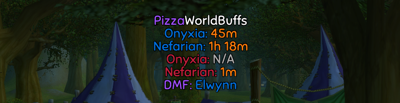

# 🍕 PizzaWorldBuffs

Addon for [TurtleWoW](https://turtle-wow.org) that shows tents on the world map, Onyxia/Nefarian head despawn timers and the last known Darkmoon Faire location. All this info is constantly being shared between all addon users so you will e.g. see tents on the map that other people have found and see timers for Ony/Nef head even if you didn't witness the buff drop yourself. See [below](#how-it-works) for more details on how it works.




> [!IMPORTANT]
>
> **This addon does NOT show you when the next Dragonslayer buff will be triggered!** 
> 
> It only shows you when the window for the buff to be triggered will open up again, i.e. when the Ony/Nef heads will despawn from the SW/OG city gates. The actual buff is only triggered when a player turns in the head of Ony/Nef and the addon can't possibly know when that's going to happen.

## Install

1. Download and extract [latest version](https://github.com/Pizzahawaiii/PizzaWorldBuffs/archive/main.zip)
2. Copy the "PizzaWorldBuffs-main" folder to `<WoW>/Interface/AddOns` and rename it to "PizzaWorldBuffs"
3. (Re)start WoW

## Version Upgrade

To update to the latest version, delete your `<WoW>/Interface/AddOns/PizzaWorldBuffs` folder and follow the [installation steps](#install) again.

If updating to the latest version causes any issues, delete `<WoW>/WTF/Account/<Account>/<Server>/<Character>/SavedVariables/PizzaWorldBuffs.lua` and restart WoW. If the problems persist, please [create an issue](https://github.com/Pizzahawaiii/PizzaWorldBuffs/issues/new).

Check the [forum post](https://forum.turtle-wow.org/viewtopic.php?t=13704) or the [commit history](https://github.com/Pizzahawaiii/PizzaWorldBuffs/commits/main) to see the latest changes.

## Commands

```
/wb                    Show all commands
/wb show               Show the addon
/wb hide               Hide the addon
/wb lock <1 or 0>      1 to lock PizzaWorldBuffs frame, 0 to unlock it
/wb header <1 or 0>    1 to show PizzaWorldBuffs header, 0 to hide it
/wb dmf <1 or 0>       1 to show Darkmoon Faire location, 0 to hide it
/wb all <1 or 0>       1 to show timers for both factions, 0 to only show timers for your faction
/wb tents <1 or 0>     1 to show tent locations on the world map, 0 to hide them
/wb tentStyle <style>  Pick a style for the tent icons on the map (1, 2, 3, 4, 5, 6, 7 or 1337)
/wb tentAlert <alert>  Show alerts for new tents (2 = anywhere, 1 = current zone, 0 = disabled)
/wb whereTents         Show all known tent locations
/wb logout <1 or 0>    1 to log out automatically after receiving the next buff, 0 to stay logged in
/wb exit <1 or 0>      1 to exit game automatically after receiving the next buff, 0 to stay logged in
/wb reset              Reset PizzaWorldBuffs frames to their default positions
/wb fontSize <size>    Change the font size of the PizzaWorldBuff frame (Default: 14)
/wb align <x>          Change text alignment. Valid options: left, center, right (Default: center)
/wb dmfbuffs           Show a list of all available Darkmoon Faire buffs
/wb version            Show current PizzaWorldBuffs version
```

## Reporting Timers


You can report your timers via chat in different ways. If your chat edit box is open (`Enter`), clicking one of your timers while holding `Shift` will paste it into the edit box so you only have to press Enter again to share it. This also works for [WIM](https://github.com/shirsig/WIM) chat windows, but only if one of those WIM edit boxes is currently focussed.

Additionally, if the default chat edit box is not open and no WIM edit box is focussed, you can use the following shortcuts for convenient timer reporting:

- `Shift-Leftclick` immediately reports the timer in `/say`
- `Shift-Rightclick` immediately reports the timer in `/guild`
- `Shift-Middleclick` immediately reports the timer in `/h` (TurtleWoW's HC channel)

> [!TIP]
> If you get asked which addon you're using for buff timers, try shift-clicking the "PizzaWorldBuffs" header! 😉

## How it Works

PizzaWorldBuffs uses different triggers for detecting tents, Dragonslayer buffs and Darkmoon Faire location. When one of those is detected on your character, the addon continuously broadcasts that information to all other addon users in the background. On the flipside, when the addon receives previously unknown (to you) tent/buff/DMF information from other players, it stores that info for you and also shares it with other players again from that point on.

### Tent Location Detection

The addon detects tents by constantly scanning your rested XP gain rate. As soon as that climbs up to at least +0.2% XP per second, it assumes you're standing under a tent. It then gets your current location and draws a tent on the map at those coordinates.

### Ony/Nef Head Timer Detection

To detect that an Ony/Nef buff popped, the addon uses the SW/OG-wide messages yelled by NPCs when someone triggers the buff. Once detected, it stores and broadcasts the server time at which the head will despawn again (i.e. 2 hours from now) and uses that for the countdown timer.

### DMF Location Detection

The location of the Darkmoon Faire is detected, stored and broadcasted when you move your mouse cursor over any of the DMF NPCs.

### Data Storing & Sharing

All data is stored persistently, so you will keep it even after relogging or reloading your UI. All the information is (eventually) propagated to and reshared by everyone who's using the addon. So the data will continue to be broadcasted, even after the player who originally found the tent, buff or DMF location has logged off.

### Buff Timer Color-Coding

A boss name's color designates the faction/city where the buff was triggered:

- **Blue:** Alliance (Stormwind)
- **Red:** Horde (Orgrimmar)

The color of the timer itself denotes how confident the addon is in the correctness of that specific timer:

- **Green:** High confidence *(You have witnessed that buff yourself)*
- **Orange:** Medium confidence *(The person you received the timer from has witnessed that buff themselves)*
- **Red:** Low confidence *(Neither you nor the person you received the timer from have actually witnessed that buff)*

### Buff Timer Prioritization

The addon only accepts timers it receives from other players if it has the same or higher confidence in them than in your current timer for the respective boss/faction. If you currently don't have any timer for that boss/faction, the addon accepts any timer it receives. Timers you witnessed yourself are always accepted.

## FAQ

### Q: Why don't I see a tent on the map even though there is one there?

Probably because nobody using PizzaWorldBuffs is or was sitting under that tent, see [How it Works](#how-it-works)

### Q: Why don't I have a timer even though someone told me that buff just triggered?

Most likely because the person who told you doesn't use PizzaWorldBuffs, see [How it Works](#how-it-works).

### Q: The Darkmoon Faire is not there, even though PizzaWorldBuffs told me it was.

PizzaWorldBuffs only shows the last known DMF location, it doesn't guarantee that the faire is still there. You can check how long ago the faire was seen at the location the addon shows you by moving your mouse cursor over it.

Note that DMF takes a break and shuts down every Wednesday and moves its location every Sunday at midnight (server time).

### Q: Why doesn't PizzaWorldBuffs show me some of the data I know it shows to other players?

It can take some time for all the data to be shared with other players, so you might have to wait a little bit. If you still don't see it after 3 minutes, please [create an issue](https://github.com/Pizzahawaiii/PizzaWorldBuffs/issues/new).

### Q: I don't ever see any data at all. No tents, no buff timers and no DMF location.

Try relogging or running `/join LFT`. If that doesn't help, please [create an issue](https://github.com/Pizzahawaiii/PizzaWorldBuffs/issues/new).

The addon uses TurtleWoW's hidden `LFT` chat channel to receive data from and share data with other players. It should automatically join that channel whenever the addon is loaded. But if it doesn't, maybe one of your other addons is interfering. You can check if you're in that channel by right-clicking your chat tab and selecting "Channels". You can also try disabling all other addons.

### Q: What's the best pizza topping?

🍍

## Contact

You're always more than welcome to ask questions or provide any kind of feedback.

- **Turtle Discord**: Pizzahawaii
- **Nordanaar**: Pizzahawaii, Pizzamista, Pizzapimp<br />If you see anyone whose name starts with 'Pizza', chances are it's me. 

## Acknowledgements

🐢 The members of \<TURTLE HARDCORE\> who constantly provide valuable feedback

❤️ [Shagu](https://github.com/shagu) - Thanks for all the help!
